## Lab1 服务端部署以及玩家名称服务

### 0. 开发部署说明

<span style="color:red">**Workshop 中的业务代码仅做 Serverless 开发部署流程的功能性演示，非业务开发最佳实践，实际业务开发需综合考虑性能、可扩展性、可靠性、成本、安全**</span>

### 1. 服务端部署

创建一个目录，用于存放后续所有服务端代码以及 SAM 的 template

```shell
mkdir ~/Serverless-GameServer-Workshop
cd ~/Serverless-GameServer-Workshop
```


#### 1.1 通过 SAM template 创建一个 HTTP 的 hello world

后续的游戏内 HTTP 服务将基于此进行修改和扩展


##### 1.1.1 创建 SAM template 文件

在`~/Serverless-GameServer-Workshop`目录下编辑或新建`template.yaml`文件，添加如下内容

~/Serverless-GameServer-Workshop/template.yaml

```yaml
AWSTemplateFormatVersion: '2010-09-09'
Transform: AWS::Serverless-2016-10-31
Description: >
  Serverless-GameServer-Workshop

# 全局参数段
Globals:
  Function:
    Timeout: 300 # Lambda 函数执行超时时间，单位是秒

# 资源段
# 服务端所有的资源会在 SAM template 中定义
# SAM 底层的原理是会创建一个 cloudformation 来进行资源的管理
Resources:
  PlayerMgr: # 资源的名称
    Type: AWS::Serverless::Api # 资源的类型，这里是 APIGateway
    Properties: # 资源的属性配置
      Name: Workshop-PlayerMgr # APIGATEWAY 的名称

  PlayerInfoFunction:
    Type: AWS::Serverless::Function # 资源类型，此处是 Lambda
    Properties:
      Description: 'Player Info' # 函数说明
      CodeUri: player-manager/ # Lambda 函数代码所在的目录
      Handler: main.main_handler # Lambda 函数处理的 method
      Runtime: python3.9 # Lambda 执行代码的 runtime，支持 NodeJS, Python, Java, Golang 等
      Architectures: # 底层运行代码的 CPU 架构
        - arm64 # 一般代码没有特殊依赖推荐 ARM 架构，更高性价比
      Events: # Lambda 事件触发配置
        LambdaEvent: # 名称
          Type: Api # 事件触发类型，此处为 APIGATEWAY
          Properties: # 事件触发配置，以下表示通过刚刚配置的"PlayerMgr" APIGATEWAY 的 Endpoint "/create_user" 这个 path 访问时，触发 Lambda
            Path: /create_user
            Method: post
            RestApiId: !Ref PlayerMgr
```


##### 1.1.2 创建服务端代码

在 template.yaml 相同目录下创建代码目录`player-manager`，名称对应于 template.yaml 里配置的 `Resources.PlayerInfoFunction.Properties.CodeUri`

```shell
mkdir ~/Serverless-GameServer-Workshop/player-manager
```

在 `~/Serverless-GameServer-Workshop/player-manager` 目录下创建 `main.py` 文件，并且在 main.py 文件中添加 main_handler 方法，名称对应于 template.yaml 里配置的 `Resources.PlayerInfoFunction.Properties.Handler`

~/Serverless-GameServer-Workshop/player-manager/main.py

```python
import json

def main_handler(event, context):
    try:
        print(event) # 通过打印event，可以在CloudWatch Log看到event的结构
        path = event.get('path') # 获取path
        res_msg = "Path '%s' not registered." % path # 默认返回信息
        response = {'statusCode': 404, 'body': json.dumps({"msg": res_msg})} # 默认返回404

        event_body = event.get('body') # 获取body
        event_body = json.loads(event_body if event_body is not None else '{}') # 将body转换为dict

        # 如果path为/create_user，对应于 template.yaml 中的 /create_user 路径
        if path == "/create_user":
            response = {'statusCode': 200, 'body': json.dumps({"msg": "create user success"})}
            return response

        # 默认返回
        return response
    except Exception as err:
        return {'statusCode': 500}
```


##### 1.1.3 代码及文件解释

* template.yaml 定义所有部署在 aws 上的资源以及其配置，包括 APIGateway、Lambda 等
* SAM 将 template.yaml 中定义的资源转化为 Cloudformation template，并通过 Cloudformation 进行资源部署
* 在上面的 template.yaml 中定义了 APIGateway 和 Lambda 两种资源：
  * APIGateway 用于提供客户端访问入口，HTTP URL，并把请求以事件（event）的形式传给 Lambda 进行处理
  * Lambda 用于实际处理业务逻辑，return 的结果会由 APIGateway 返回给客户端


##### 1.1.4 通过 SAM CLI 部署资源

切换到 template.yaml 相同的目录下

```shell
cd ~/Serverless-GameServer-Workshop
```

检查 template.yaml 是否正常

```shell
sam validate
# 如果 template.yaml 正常则会返回 "xxx is a valid SAM Template" 
```

build & deploy 代码（**在正式环境中使用，本次 Workshop 不使用此方法进行部署**）

```shell
sam build
sam deploy --guided
```

sync project 实时同步代码和架构变更到 AWS（**本次 Workshop 使用此方法进行部署，用于演示开发阶段的调试过程**）

```shell
sam sync --stack-name Serverless-GameServer-Workshop
# Serverless-GameServer-Workshop 是 Cloudformation Stack 的名称，可以在下一节查看 Cloudformation 资源创建情况
# 可以加上 --watch 参数，表示实时同步代码和架构（template.yaml）的变更到 Cloudformation
```


##### 1.1.5 检查资源创建结果

分别在控制台查看 SAM 创建的 Cloudformation，Cloudformation 创建的 APIGateway 和 Lambda

**Cloudformation**

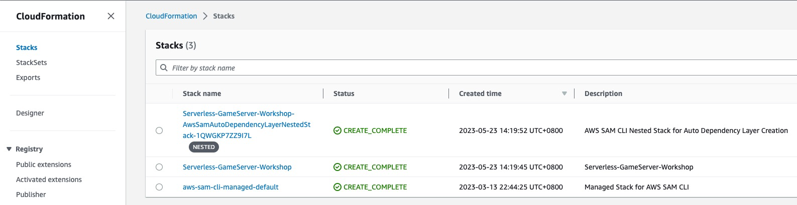


**APIGateway**

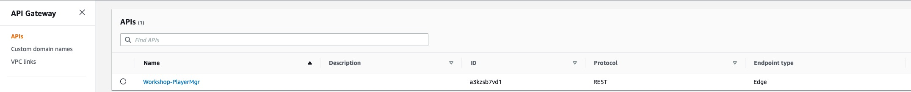

选择创建的 APIGateway，查看 APIGateway 的 Stage

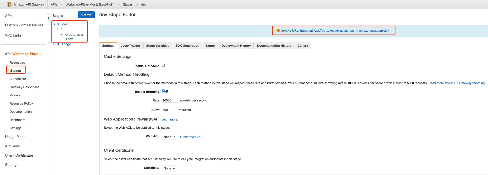

* 可以看到已创建的 Stage "dev"、path "/create_user" 以及调用这个 APIGateway 的 URL


**Lambda**

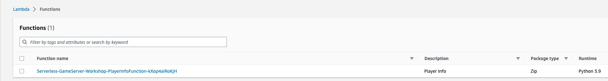

选择创建的 Lambda，查看触发 Lambda 事件配置

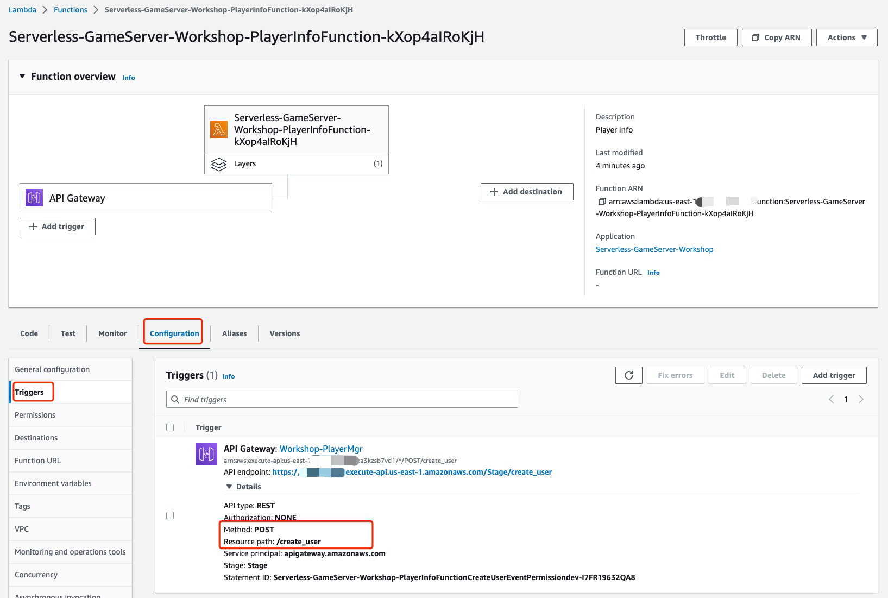

* 可以看到这个 Lambda 函数是通过调用我们创建的 APIGateway /create_user 这个 path 来进行触发


##### 1.1.5 测试服务端部署结果

从 1.1.4 节的 APIGateway 资源处找到 APIGateway 的 URL，直接通过本地命令或 postman 来测试刚刚部署的 HTTP server 是否正常

```shell
# 因为在 template.yaml 中在 Lambda 处注册的 Event 是 APIGateway post，所以其他的 method 会 403 
curl "https://aabbcc.execute-api.us-east-1.amazonaws.com/dev/create_user"
{"message":"Missing Authentication Token"}%

curl -XPOST "https://aabbcc.execute-api.us-east-1.amazonaws.com/dev/create_user" -H 'Content-Type: application/json' -d '{"user_id":"test_user"}'
{"msg": "create user success"}%
```


##### 1.1.6 查看服务端日志

可以通过 CloudWatch Log 来查看 Lambda 执行时的日志，选择 PlayerInfoFunction 这个 Lambda 的 log group


选择最新的 log stream

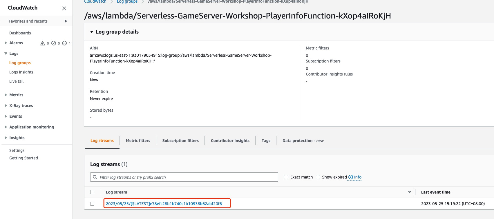

一个完整的 Lambda 调用的日志

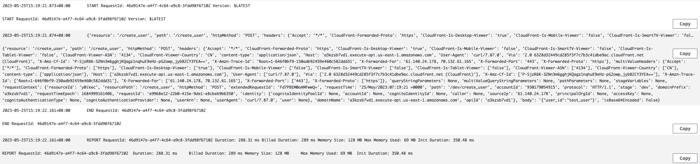

* START RequestId：记录 Lambda 被调用的 ID 和时间
* {'resource': '/create_user' .....}：代码中打印的 event 内容，这些数据是由 APIGateway 传到 Lambda 进行处理
* END RequestId：记录 Lambda 调用结束的时间
* REPORT RequestId：记录本次调用耗时、用于计费的耗时以及内存使用情况


**我们不仅可以通过控制台的方式来查看服务端日志，也可以通过 CLI 来实时查看服务端日志，类似于本地开发时将日志写入到文件后，用 tail -f 命令进行实时查看**

```shell
aws logs tail /aws/lambda/Serverless-GameServer-Worksho-PlayerInfoFunction-1xgY5j45ekEX --follow
```

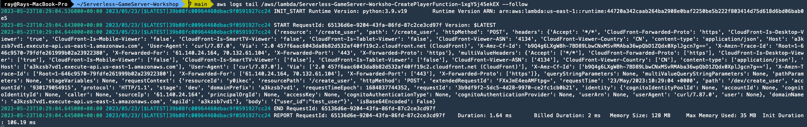


至此，我们通过 SAM template 部署了一个 APIGateway + Lambda 的 HTTP hello world，并且通过 CloudWatch Log 来查看服务端日志


#### 1.2 修改 Hello world 代码，实现用户创建功能

##### 1.2.1 修改 template.yaml，添加 Dynamodb 资源，sync template 到 AWS

编辑 template.yaml 文件，在末尾添加 Dynamodb 的 resource

```yaml
...
  PlayerInfoTable:
    Type: AWS::DynamoDB::Table # 资源类型，此处是 Dynamodb table
    Properties:
      AttributeDefinitions: # Dynamodb 中的字段定义
        - AttributeName: "user_id"
          AttributeType: "S" # user_id 字段为 string
      KeySchema: # Primary key 配置，这里使用单个 Partition key 做 Primary key
        - AttributeName: "user_id"
          KeyType: "HASH"
      ProvisionedThroughput: # 预置 throughput
        ReadCapacityUnits: 5
        WriteCapacityUnits: 5
      SSESpecification:
        SSEEnabled: True # Server Side Encryption 开启服务端加密
      TableName: "player_info" # DDB table 名称
```

执行 sam sync 同步资源到云上

```shell
sam sync --stack-name Serverless-GameServer-Workshop
```


##### 1.2.2 检查 Dynamodb 资源创建结果

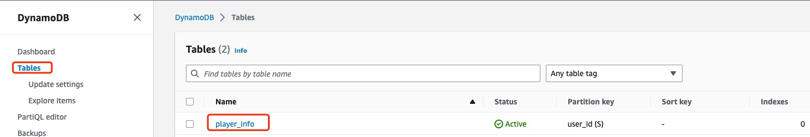

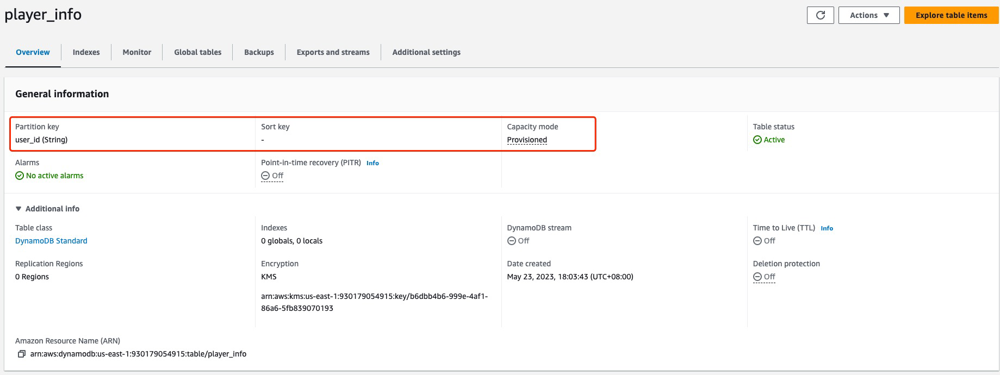


##### 1.2.3 编辑 ~/Serverless-GameServer-Workshop/player-manager/main.py 代码，添加 create_user 的逻辑

在 main_handler 方法前添加全局的 Dynamodb table 资源

```python
import json
import boto3

# 通过boto3.resource('dynamodb')获取DynamoDB的资源
# player_info 为表名对应于 template.yaml 中的 Resources -> PlayerInfoTable -> Properties -> TableName
player_info_table = boto3.resource('dynamodb').Table("player_info")

def main_handler(event, context):
  ...
```

添加一个函数用于判断客户端传入的 user_id 是否已存在

```python
import json
import boto3

# 通过boto3.resource('dynamodb')获取DynamoDB的资源
# player_info 为表名对应于 template.yaml 中的 Resources -> PlayerInfoTable -> Properties -> TableName
player_info_table = boto3.resource('dynamodb').Table("player_info")

# 判断user_id是否存在
def getUserInfo(user_id):
    response = player_info_table.get_item(Key={"user_id": user_id})
    if "Item" in response:
        return response["Item"]
    else:
        return None

def main_handler(event, context):
  ...
```

修改 main_handler 以实现玩家名称写入 Dynamodb

```python
def main_handler(event, context):
    try:
        print(event) # 通过打印event，可以在CloudWatch Log看到event的结构
        path = event.get('path') # 获取path
        method = event.get('httpMethod') # 获取method
        event_body = event.get('body') # 获取body
        event_body = json.loads(event_body if event_body is not None else '{}') # 将body转换为dict
        # 如果path为/create_user，对应于 template.yaml 中的 /create_user 路径
        if path == "/create_user":
            if method == "POST":
                if "user_id" in event_body and event_body["user_id"] != "":
                    if getUserInfo(event_body["user_id"]) == None:
                        player_info_table.put_item(Item={"user_id": event_body["user_id"]})
                        return { 'statusCode': 200, 'body': json.dumps({"msg": "create user success"}), }
                    else:
                        return { 'statusCode': 400, 'body': json.dumps({"msg": "user_id exists"}), }
                else:
                    return { 'statusCode': 400, 'body': json.dumps({"msg": "empty user_id"}), }
    except Exception as err:
        print(err)
        return { 'statusCode': 500, 'body': json.dumps({"msg": str(err)}) }
```

执行 sam sync 同步资源到云上

```shell
sam sync --stack-name Serverless-GameServer-Workshop
```


##### 1.2.4 测试代码运行

```shell
curl -XPOST "https://aabbcc.execute-api.us-east-1.amazonaws.com/dev/create_user" -H 'Content-Type: application/json' -d '{"user_id":"test_user"}'
{"msg": "An error occurred (AccessDeniedException) when calling the GetItem operation: User: arn:aws:sts::123456789:assumed-role/Serverless-GameServer-Wor-PlayerInfoFunctionRole-1CSMEMP2JLOJ4/Serverless-GameServer-Worksho-PlayerInfoFunction-1xgY5j45ekEX is not authorized to perform: dynamodb:GetItem on resource: arn:aws:dynamodb:us-east-1:123456789:table/player_info because no identity-based policy allows the dynamodb:GetItem action"}%
```

可以看到错误日志为 Lambda 没有执行 dynamodb:GetItem 的权限，需要给 Lambda 添加操作 AWS 资源的权限

（这里需解释一下 AWS 上的身份认证和权限管理 IAM）


##### 1.2.5 创建 IAM Role，并将 Role 关联到 Lambda

创建 role

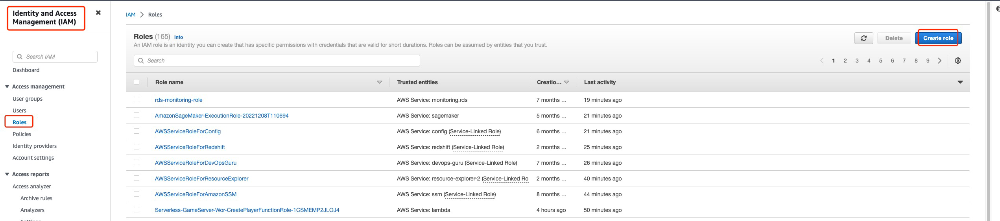

trusted entity type 选择 AWS service，Use case 选择 Lambda


添加 Administrator 权限，此处 workshop 仅做演示，为后续 Lambda 操作其他 AWS 资源方便而直接赋 Administrator 权限，未满足最小权限原则，生产环境中请按最小权限原则进行设置

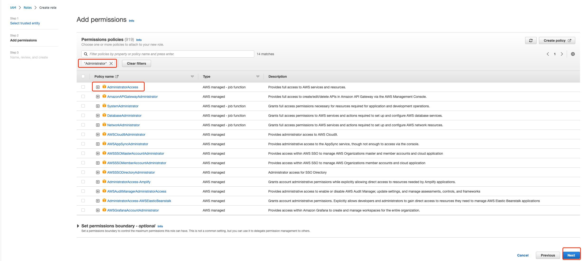

填入 Role name "Workshop-Lambda-Role" 进行创建

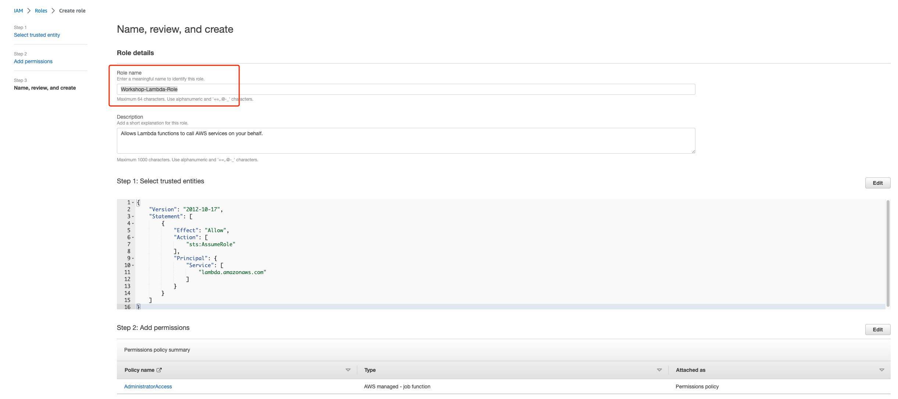

创建完成后，找到刚刚创建的 Role 的资源标识 ARN

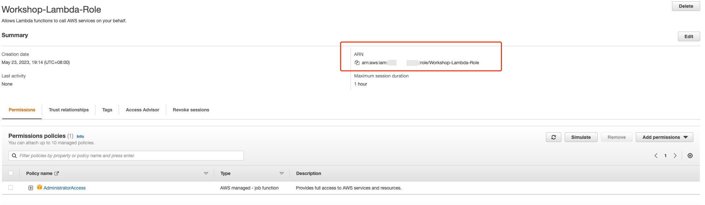

修改 template.yaml 文件，将刚刚创建的 Workshop-Lambda-Role 关联到 Lambda

* 将 Role 资源改为自己创建的

```yaml
  PlayerInfoFunction:
    Type: AWS::Serverless::Function # 资源类型，此处是 Lambda
    Properties:
      ...
      Role: "arn:aws:iam::123456789:role/Workshop-Lambda-Role" # Lambda 执行时的权限
      Events: # Lambda 事件触发配置
        ...
```

执行 sam sync 同步资源到云上

```shell
sam sync --stack-name Serverless-GameServer-Workshop
```


##### 1.2.6 再次测试代码运行

```shell
~: curl -XPOST "https://aabbcc.execute-api.us-east-1.amazonaws.com/dev/create_user" -H 'Content-Type: application/json' -d '{"user_id":"test_user"}'
{"msg": "create user success"}%
~: curl -XPOST "https://aabbcc.execute-api.us-east-1.amazonaws.com/dev/create_user" -H 'Content-Type: application/json' -d '{"user_id":"test_user"}'
{"msg": "create user failed: user_id already exists"}%
~: curl -XPOST "https://aabbcc.execute-api.us-east-1.amazonaws.com/dev/create_user" -H 'Content-Type: application/json' -d '{"user_id":""}'
{"msg": "create user failed: empty user_id"}%
~: curl -XPOST "https://aabbcc.execute-api.us-east-1.amazonaws.com/dev/create_user" -H 'Content-Type: application/json'
{"msg": "create user failed: empty user_id"}%
```

给 Lambda 赋上权限后，Lambda 可以正常执行，向 Dynamodb 进行读写


##### 1.2.7 查看 Dynamodb 中的数据

使用 aws cli 来查看 Dynamodb 中刚刚写入的数据

```shell
~: aws dynamodb scan --table-name player_info --no-cli-pager
{
    "Items": [
        {
            "user_id": {
                "S": "test_user"
            }
        }
    ],
    "Count": 1,
    "ScannedCount": 1,
    "ConsumedCapacity": null
}
```


#### 1.3 添加代码，实现用户删除功能

##### 1.3.1 修改 main_handler 以实现玩家名称从 Dynamodb 中删除

```python
def main_handler(event, context):
    try:
        ......
        if path == "/create_user":
            if method == "POST":
                ......
        elif path == "/delete_user": # 以下代码由 CodeWhisperer 生成
            if method == "POST":
                if "user_id" in event_body and event_body["user_id"] != "":
                    if getUserInfo(event_body["user_id"]) != None:
                        player_info_table.delete_item(Key={"user_id": event_body["user_id"]})
                        return { 'statusCode': 200, 'body': json.dumps({"msg": "delete user success"}), }
                    else:
                        return { 'statusCode': 400, 'body': json.dumps({"msg": "user_id not exists"}), }
                else:
                    return { 'statusCode': 400, 'body': json.dumps({"msg": "empty user_id"}), }
    except Exception as err:
        ......
```


##### 1.3.2 修改 template.yaml 以实现访问 APIGateway /delete_user path 可以触发 main_handler

* 将 Role 资源改为自己创建的

```yaml
  PlayerInfoFunction:
    Type: AWS::Serverless::Function # 资源类型，此处是 Lambda
    Properties:
      ......
      Role: "arn:aws:iam::123456789:role/Workshop-Lambda-Role" # Lambda 执行时的权限
      Events: # Lambda 事件触发配置
        CreateUserEvent: # 名称
          ......
        DeleteUserEvent: # 名称
          Type: Api
          Properties:
            Path: /delete_user
            Method: post
            RestApiId: !Ref PlayerMgr
```


执行 sam sync 同步资源到云上

```shell
sam sync --stack-name Serverless-GameServer-Workshop
```


##### 1.3.3 检查资源同步结果

我们在 PlayerInfoFunction 这个 Lambda 的 Events 里添加了 DeleteUserEvent，触发条件是 APIGateway 的 /delete_user path，在 Lambda 控制台查看配置更新结果

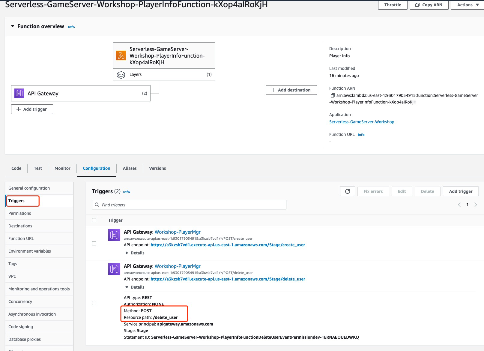


##### 1.3.4 测试玩家删除功能代码运行

```shell
~: curl -X POST "https://aabbcc.execute-api.us-east-1.amazonaws.com/dev/delete_user" -H 'Content-Type: application/json'
{"msg": "empty user_id"}%
~: curl -X POST "https://aabbcc.execute-api.us-east-1.amazonaws.com/dev/delete_user" -H 'Content-Type: application/json' -d '{"user_id":"test_user"}'
{"msg": "delete user success"}%
~: curl -X POST "https://aabbcc.execute-api.us-east-1.amazonaws.com/dev/delete_user" -H 'Content-Type: application/json' -d '{"user_id":"test_user"}'
{"msg": "user_id not exists"}
```

代码运行正常

### 2. 客户端部署

本次 Workshop 中的客户端是用 Godot 引擎 export 的 HTML5 应用，在浏览器运行，不需要对客户端做任何开发，只需要配置之前用 SAM 部署的 APIGateway URL 即可

<span style="color:red">客户端非本次 Workshop 重点，功能仅做演示，可能会有 Bug，欢迎反馈</span>


#### 2.1 启动客户端

在 HTML5 代码目录下启动一个 http server，客户端代码获取方式请参考 1_prerequisite

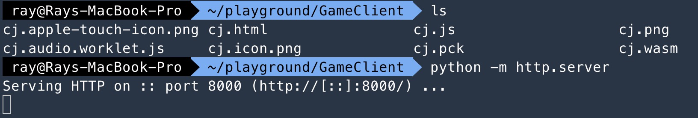

访问 localhost:8000/cj.html

 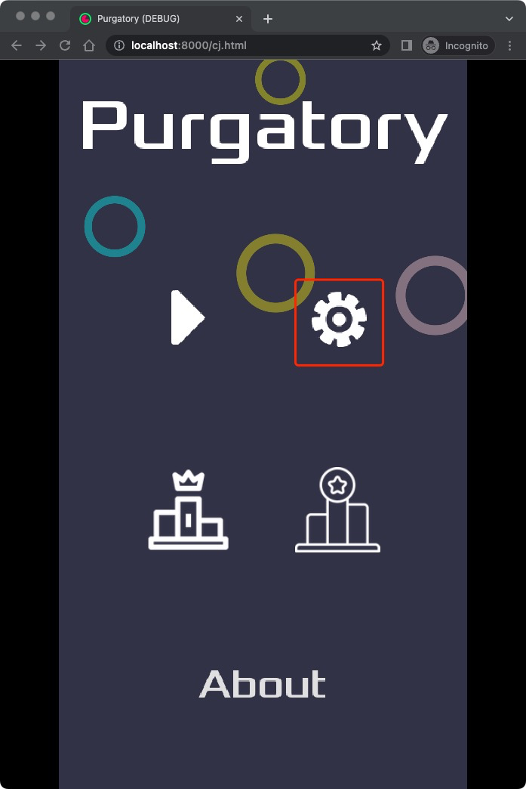


#### 2.2 配置 Serverlist 

一般游戏客户端会通过配置文件或请求 Serverlist 文件来实现，本 Workshop 为展示客户端访问逻辑，通过手动配置服务端地址 Serverlist

 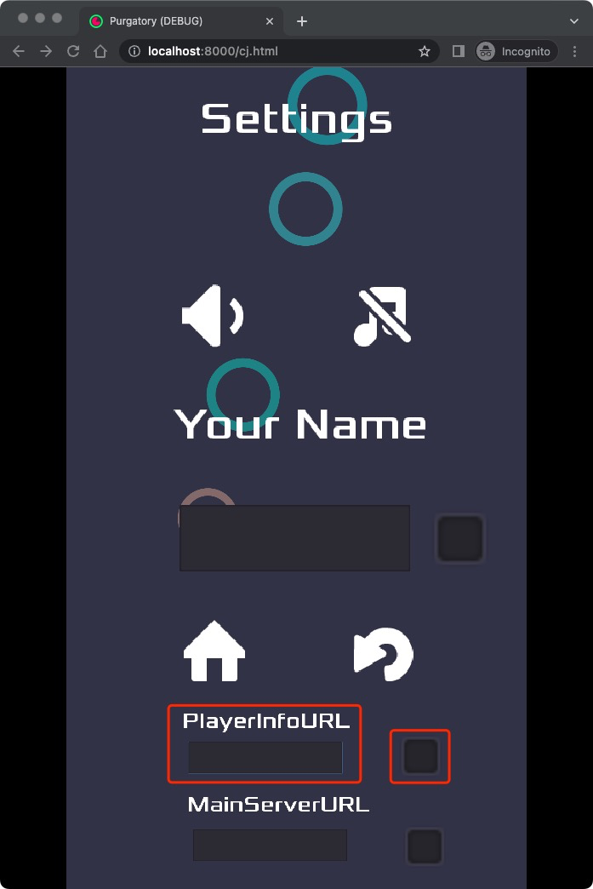


这里可以看到有三个配置项：

* PlayerInfoURL：HTTP 服务地址，目前只用于设置玩家姓名
* MainServerURL：Websocket 服务地址，用于后面实验需要实现的游戏内匹配、战斗、结算等功能
* Player Name：玩家姓名，需要先设置 PlayerInfoURL 才可以向服务端发送请求创建用户

将 1.1.5 节查到的 APIGateway 的 dev stage 地址填入 PlayerInfoURL 中，点右边方块确定，此时客户端会做以下操作：

* 在本地写一个配置文件，用于在每次客户端启动的时候读取已配置的 PlayerInfoURL


#### 2.3 测试玩家创建和删除功能

填入玩家姓名，点击右边方块确认

 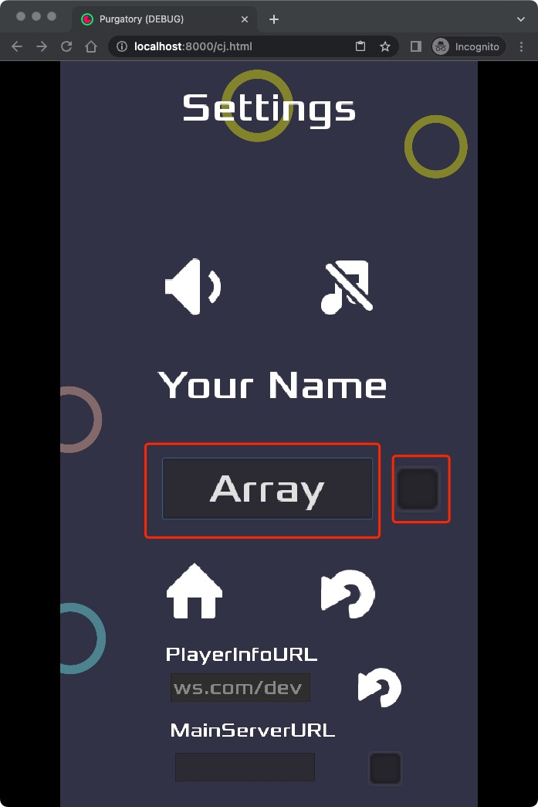

**点击方块确认后客户端会执行以下行为**：

1. 向 "https://$PLAYERMGR_URL/create_user" 发送 http post 请求，body 为 json `{"user_id": $user_name}`
1. 其中 $PLAYERMGR_URL 为配置的 GameServer 地址，user_name 为填入的内容
1. 服务端返回正确后，会在本地写一个文件 player_name.save 存放玩家名称，后续客户端如果在本地读到 player_name.save 后会使用文件里的玩家姓名，后续客户端在发送请求时会同时带上 user_id


没有任何返回，打开开发者模式查看运行日志

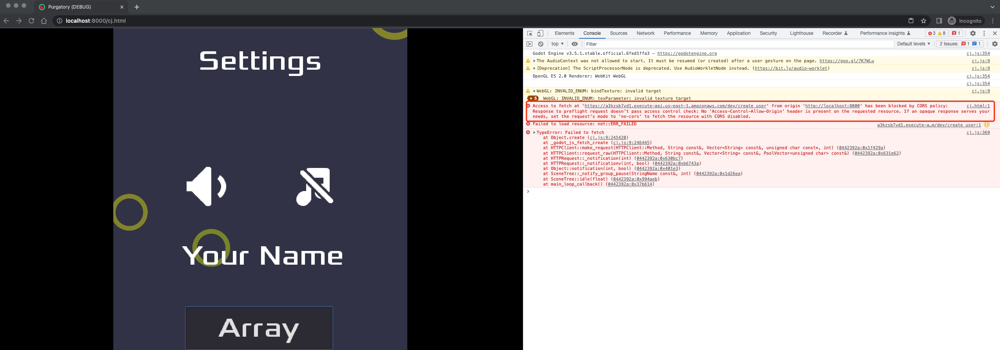

发现是因为服务端不支持 CORS block 了来自本地 HTML5 的请求


**至此，虽然创建玩家的服务还未跑通，但客户端的部署配置已全部完成，修改服务端支持 CORS 请参考下一章。**


### 3. 服务端支持 CORS

关于如何使 APIGateway + Lambda 支持 CORS 可以参考 [Enabling CORS for a REST API resource](https://docs.aws.amazon.com/apigateway/latest/developerguide/how-to-cors.html)，需要满足以下条件：

1. 对于 CORS 请求，会先向 APIGateway 发送一个 options 请求，请求通过后再发送 POST 请求
2. options 和 post 请求的返回都需要包含特定的 header


在本 Workshop 中会通过以下变更来支持 CORS 使得本地的 HTML5 游戏客户端可以访问服务端：

1. 给 APIGateway 对应的 path 添加 options method
2. 给所有的 http 返回添加特定的 header


#### 3.1 APIGateway 给 /create_user 和 /delete_user 注册 OPTIONS method

编辑 template.yaml 文件

```yaml
  PlayerInfoFunction:
    Type: AWS::Serverless::Function # 资源类型，此处是 Lambda
    Properties:
      ......
      Events: # Lambda 事件触发配置
        CreateUserEvent: # 名称
          ...
        DeleteUserEvent: # 名称
          ...
        CreateUserOptionsEvent:
          Type: Api
          Properties:
            Path: /create_user
            Method: options
            RestApiId: !Ref PlayerMgr
        DeleteUserOptionsEvent:
          Type: Api
          Properties:
            Path: /delete_user
            Method: options
            RestApiId: !Ref PlayerMgr
```

编辑  main_handler，让 post 和 options 请求返回都包含特定的 headers

```python
import json
import boto3
...
# 设置返回的headers以支持CORS
headers = {
    'Access-Control-Allow-Origin': '*',
    'Access-Control-Allow-Methods': 'POST,OPTIONS',
    'Access-Control-Allow-Headers':'Content-Type,Access-Control-Allow-Origin,Access-Control-Allow-Methods,Access-Control-Allow-Headers',
}
...
def main_handler(event, context):
    try:
        print(event) # 通过打印event，可以在CloudWatch Log看到event的结构
        path = event.get('path') # 获取path
        method = event.get('httpMethod') # 获取method
        event_body = event.get('body') # 获取body
        event_body = json.loads(event_body if event_body is not None else '{}') # 将body转换为dict
        # 如果path为/create_user，对应于 template.yaml 中的 /create_user 路径
        if path == "/create_user":
            if method == "POST":
                if "user_id" in event_body and event_body["user_id"] != "":
                    if getUserInfo(event_body["user_id"]) == None:
                        player_info_table.put_item(Item={"user_id": event_body["user_id"]})
                        return { 'statusCode': 200, 'headers': headers, 'body': json.dumps({"msg": "create user success"}), }
                    else:
                        return { 'statusCode': 400, 'headers': headers, 'body': json.dumps({"msg": "user_id exists"}), }
                else:
                    return { 'statusCode': 400, 'headers': headers, 'body': json.dumps({"msg": "empty user_id"}), }
            elif method == "OPTIONS":
                return { 'statusCode': 200, 'headers': headers, 'body': json.dumps({"msg": "options success"}), }
        elif path == "/delete_user":
            if method == "POST":
                if "user_id" in event_body and event_body["user_id"] != "":
                    if getUserInfo(event_body["user_id"]) != None:
                        player_info_table.delete_item(Key={"user_id": event_body["user_id"]})
                        return { 'statusCode': 200, 'headers': headers, 'body': json.dumps({"msg": "delete user success"}), }
                    else:
                        return { 'statusCode': 400, 'headers': headers, 'body': json.dumps({"msg": "user_id not exists"}), }
                else:
                    return { 'statusCode': 400, 'headers': headers, 'body': json.dumps({"msg": "empty user_id"}), }
            elif method == "OPTIONS":
                return { 'statusCode': 200, 'headers': headers, 'body': json.dumps({"msg": "options success"}), }
    except Exception as err:
        print(err)
        return { 'statusCode': 500, 'headers': headers, 'body': json.dumps({"msg": str(err)}) }
```

执行 sam sync 同步资源到云上

```shell
sam sync --stack-name Serverless-GameServer-Workshop
```


#### 3.2 测试游戏客户端创建/删除玩家功能

创建玩家

 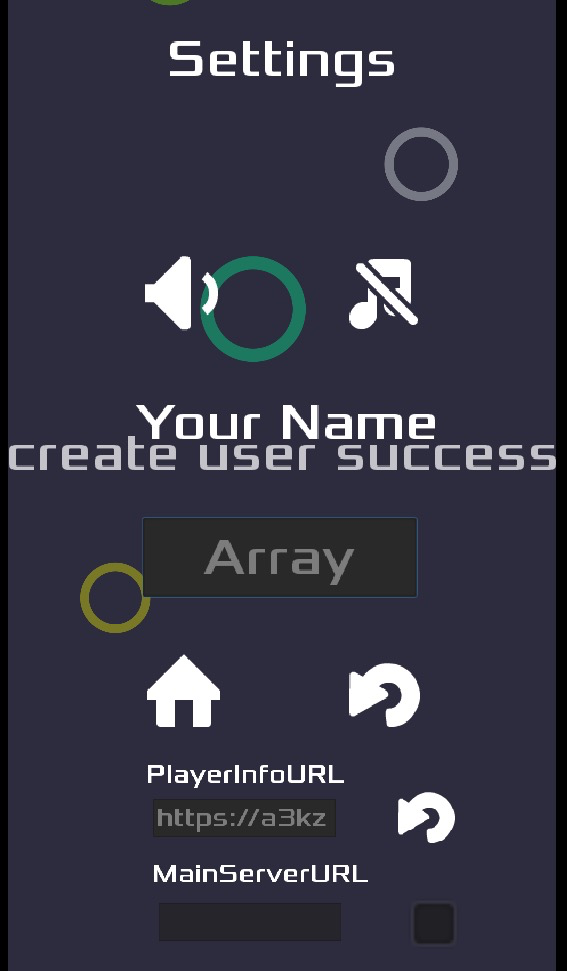


删除玩家

 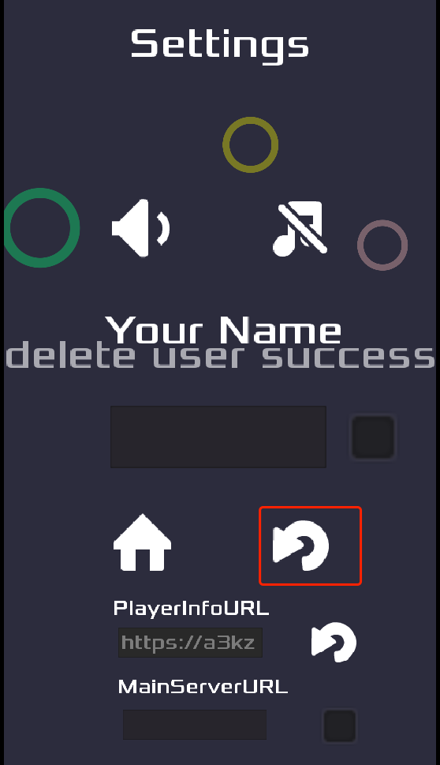


### Lab1 总结

恭喜你完成 Lab1，在 Lab1 中我们完成了以下任务：

1. 通过 SAM 部署了 HTTP 服务端，以提供玩家创建和删除功能
2. 通过配置 Serverlist 使客户端可以和 SAM 部署的服务端进行通信
3. 修改服务端以启用 CORS，使服务端支持 HTML5 应用


我们将在 Lab2 实现一个 Websocket 的服务，以实现游戏内的对战功能
