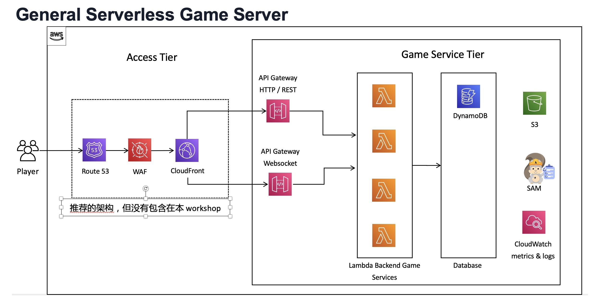

[TOC]

## Serverless GameServer Workshop 介绍

本 Workshop 针对游戏服务端开发人员，主要介绍 AWS serverless 开发模式在游戏场景下的视线

## 什么是 Serverless 以及什么是 SAM(Serverless Application Model)

TBD

## Workshop 中用到的服务

### APIGateway

### Lambda

### Dynamodb

### SAM

### IAM

### CloudWatch Log

## Serverless GameServer 架构

