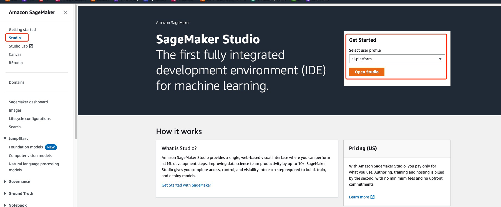

# stable-diffusion-webui-api 代码待公开

## Stable Diffusion API 架构


1. 客户端调用 APIGateway，透传请求（可以按自己需求做鉴权或过滤）到 Lambda
2. Lambda 将请求的 payload 传到 Sagemaker inference Endpoint 进行异步推理
3. 异步推理的结果会存到 S3
4. 可以通过轮询图片是否生成或 S3 事件触发 Lambda 传回图片


## 原理解释

1. 开源的 stable-diffusion-webui 是支持 api 调用的，在运行 webui.sh 的时候带上 --api 参数即可，具体可参考 [Stable-Diffusion-Webui-API](https://github.com/AUTOMATIC1111/stable-diffusion-webui/wiki/API)
2. 在 AWS 上以 Serverless 的方式部署 Stable Diffusion 的异步推理原理如下：
   1. 在 Sagemaker 上部署 stable-diffusion-webui 的代码和模型，代码以容器镜像的方式存在 ECR，模型以 tarball 的形式存在 S3
   2. 用代码（ECR 中的容器镜像）和模型（S3 中的 tarball）创建 Sagemaker Inference Endpoint 
   3. 用 APIGW+Lambda 来调用 Sagemaker Inference Endpoint
3. 用这种方式部署 Stable Diffusion 的 API 不仅可以利用 Serverless 的优势，而且可以动态扩缩 Endpoint 的容量


## 部署流程

1. 准备环境，EC2 以及部署代码
2. 构建容器镜像，容器镜像的作用是为了后续创建 inference Endpoint 使用
3. 打包模型，按照一定的目录结构打包模型，上传到 S3，后续也会在创建 inference Endpoint 时用到
4. 准备 Sagemaker Studio 环境，使用 Sagemaker Studio Notebook 执行以下流程
5. 创建 Inference Endpoint，使用 Notebook 创建 Sagemaker Inference Endpoint 用于推理
6. 测试 inference Endpoint，使用 Notebook 测试 inference Endpoint


## 环境准备

1. 一台 EC2，有 root 权限，普通 m5/m6i large 即可

2. 在 EC2 上安装 docker（不同 Linux 发行版按官网操作步骤安装），后面需要使用 docker 在本地 build push 镜像到 ECR

3. 下载 `stable-diffusion-webui-api-main` 代码 repo

   1. ```shell
      git clone https://github.com/aws-samples/amazon-ai-with-slack-bot.git
      ```

   2. ```shell
      cd amazon-ai-with-slack-bot/stable-diffusion-webui-api-main
      ```


## 构建容器镜像

<span style="color:red">执行脚本，执行前先阅读下方内容后，再进行</span>

```shell
sudo su - root
cd /path/to/stable-diffusion-webui-api-main # 进入 repo 目录
build_and_push.sh.lite us-east-1 # us-east-1 为 region，可以改为自己的 region
```


这个脚本会做以下操作：

1. 在本地 build 两个容器镜像，分别用于推理和训练，**这里只介绍推理部分原理**

   1. 这两个镜像可以自定义名称，修改脚本 inference_image, training_image 变量即可
   2. 这两个镜像的 image 代码几乎全部是开源 stable-diffusion-webui 代码，在 stable-diffusion-webui-api-main/stable-diffusion-webui 目录下
   3. 可以参考 docker build 时候的 Dockerfile：Dockerfile.inference.lite, Dockerfile.training.lite

2. 把本地 build 的容器镜像 push 到 ECR（如不存在相应的 ECR repo，则会创建一个新的）

3. <span style="color:red">如果 build training 镜像报错</span> `fatal: destination path '/opt/ml/code/extensions/sd_dreambooth_extension' already exists and is not an empty directory.`，则修改一下 Dockerfile.training.lite 文件

   1. ```dockerfile
      FROM public.ecr.aws/l1s7l7p8/all-in-one-ai-stable-diffusion-webui-training:latest
      
      COPY train.py /opt/ml/code
      COPY stable-diffusion-webui /opt/ml/code/
      
      RUN rm -rf /opt/ml/code/extensions/sd_dreambooth_extension # 添加这一行，先删掉以前的文件
      RUN git clone https://github.com/xieyongliang/sd_dreambooth_extension.git /opt/ml/code/extensions/sd_dreambooth_extension
      ```

4. 脚本跑完后，可以去 ECR 检查一下镜像是否 push 成功

   1. ECR repo 成功创建

      

   2. ECR repo 里有镜像

      

5. 这里的镜像在未来会在创建 Sagemaker Inference Endpoint 时用上


## 打包模型上传

这里的模型可以是自己训练的模型，也可以是网上（huggingface, civitai 等）上下载的模型，目前支持 `.ckpt` 和 `.safetensors` 格式


1. 创建三个空目录

   1. ```
      mkdir Stable-diffusion
      mkdir Lora
      mkdir ControlNet
      ```

   2. 这三个目录的作用和开源 stable-diffusion-webui 一致，大小写敏感

   3. <span style="color:red">如果目录结构有问题，则在后面创建 Sagemaker Inference Endpoint 是会创建失败</span>

2. 在三个目录里分别放入你自己的（或者从网上下载的）文件

   1.  `.ckpt`/`.safetensors` 格式的模型放到 Stable-diffusion 目录下
   2. lora 的文件放到 Lora 目录下
   3. <span style="color:red">这里的操作和本地自建单机版 stable-diffusion-webui 添加模型和 lora 是一样的</span>

3. 打包成 tarball 并传到 s3

   1. ```shell
      tar zcvf model.tar.gz ControlNet/ Lora/ Stable-diffusion/
      aws s3 cp model.tar.gz s3://{bucket}/model.tar.gz # 传到 S3 任意位置都可以，在后面 Sagemaker Inference Endpoint 部署时指定即可
      ```


## 准备 Sagemaker Studio 环境

使用 Sagemaker Studio Notebook 来创建 Inference Endpoint，更容易调试和修改


目前 Notebook 可以简单理解为：

1. 你可以理解为就是一台机器，有机型和大小的概念（c5.large / c5.xlarge / g5.large ...）
2. 专门用于执行机器学习任务的环境，里面预置了很多依赖和软件库（Python）
3. 可以单步执行 Python 和 Shell 代码
4. 可以写注释


在 Sagemaker Studio 中打开 `create_inference_endpoint.ipynb` 这个 Notebook：




如果这里尚无 Studio，则初始化一个 Domain 和 User profile 即可


创建 Notebook


机型选择 c5.large 即可，其他默认


将 `amazon-ai-with-slack-bot/stable-diffusion-webui-api-main`目录下的 `create_inference_endpoint.ipynb` 文件上传到 Notebook


打开`create_inference_endpoint.ipynb` 这个 Notebook，剩余步骤和解释请参考 Notebook
